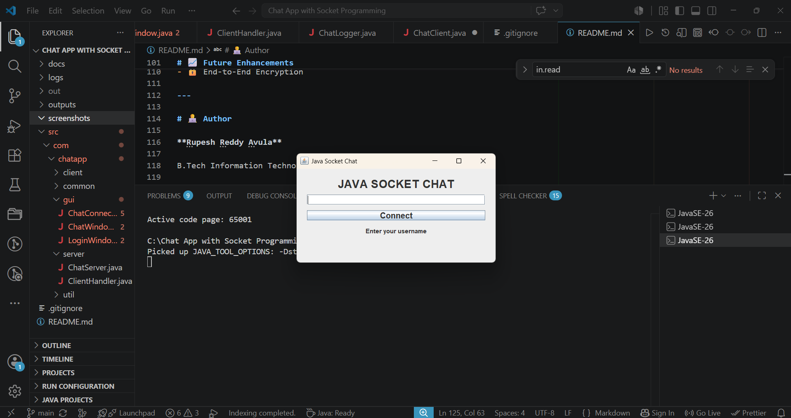
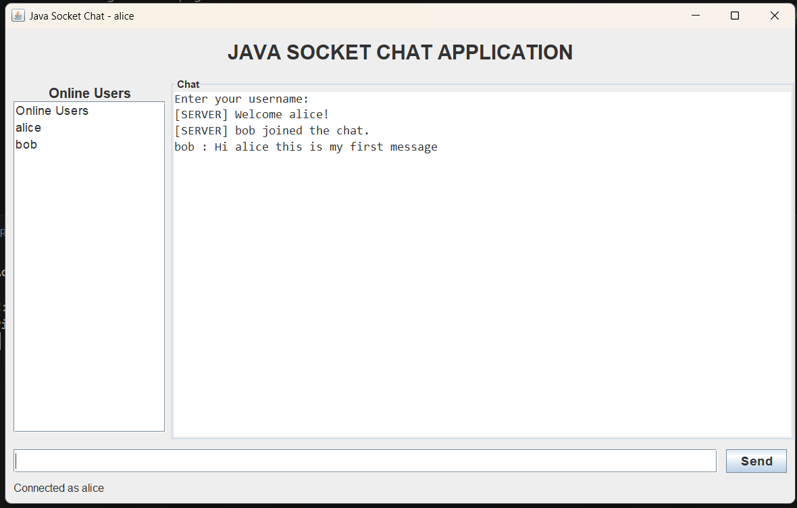
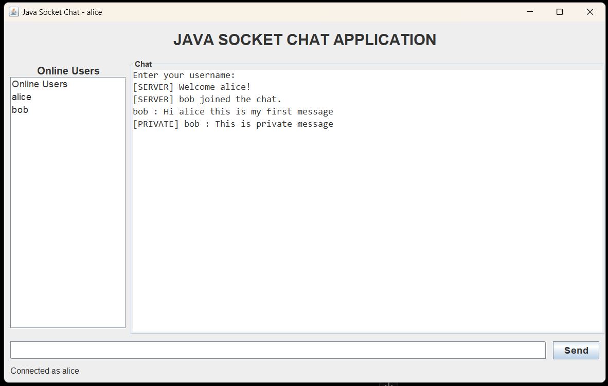
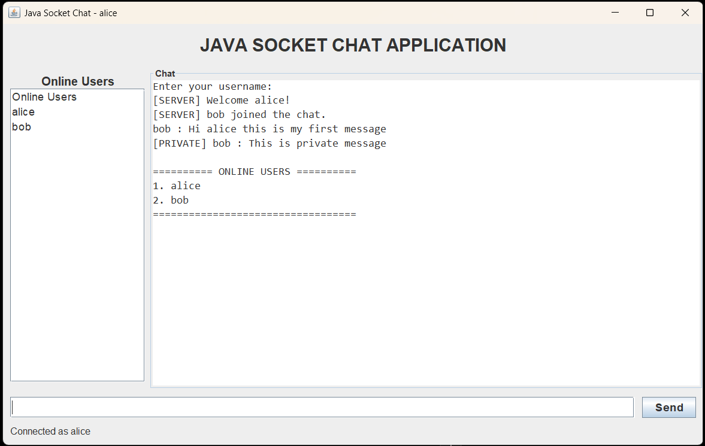
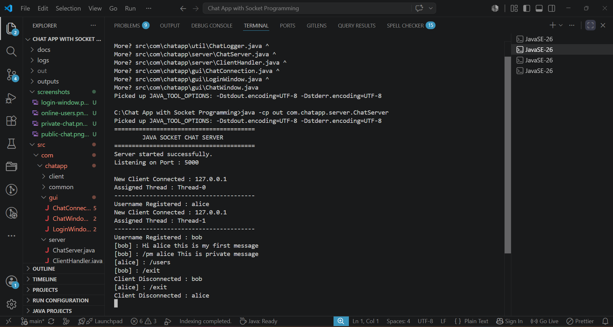

# 💬 Java Socket Chat Application


---

## 🚀 Real-Time Multi-Client Chat Application

A desktop chat application developed using **Java Socket Programming**, **TCP/IP**, **Java Swing**, and **Multithreading**.

The application enables multiple users to communicate in real time with features such as:

- Public Chat
- Private Messaging
- Live Online Users
- Swing GUI
- Multi-threaded Server

---

A **multi-threaded Client-Server Chat Application** developed using **Java Socket Programming** and **Java Swing**.

This project demonstrates real-time communication between multiple clients using TCP sockets and multithreading while providing an intuitive graphical user interface.

---

# ✨ Features

- 💬 Public Chat
- 🔒 Private Messaging
- 👥 Live Online Users
- 🖥 Java Swing GUI
- ⚡ Multi-threaded Server
- 🔑 Username Validation
- 🚪 Graceful Disconnect
- 📡 TCP Socket Communication
- 📚 Clean Object-Oriented Design

---

# 🛠 Technologies Used

- Java
- Java Swing
- Socket Programming
- TCP/IP
- Multithreading
- Git
- GitHub

# 🧠 Concepts Demonstrated

- Java Socket Programming
- TCP/IP Networking
- Client-Server Architecture
- Java Swing
- Multithreading
- Object-Oriented Programming (OOP)
- Event Handling
- Synchronization
- Collections Framework
- Git & GitHub

---


# 📂 Project Structure

```
Java-Socket-Chat-Application
│
├── docs/
├── logs/
├── outputs/
├── screenshots/
├── src/
│   └── com/
│       └── chatapp/
│           ├── client/
│           ├── gui/
│           ├── server/
│           └── util/
│
├── README.md
└── .gitignore
```

---

# 🚀 Features Demonstrated

- TCP Socket Programming
- ServerSocket
- Socket
- BufferedReader
- PrintWriter
- Java Swing GUI
- Event Handling
- Multi-threading
- Thread-safe Collections

---

# ⚙️ How to Run

## Compile

```bash
javac -d out src/com/chatapp/**/*.java
```

## Start Server

```bash
java -cp out com.chatapp.server.ChatServer
```

## Start Client

```bash
java -cp out com.chatapp.gui.LoginWindow
```

---

# 📸 Application Screenshots

## Login Window



---

## Public Chat



---

## Private Messaging



---

## Online Users



---

## Server Console



# 📈 Future Enhancements

- 🌙 Dark Mode
- 😊 Emoji Support
- 📁 File Sharing
- 🖼 Image Sharing
- 🔔 Notifications
- 📜 Chat History
- 🌐 LAN Chat
- 🔒 End-to-End Encryption

---

# 👨‍💻 Author

**Rupesh Reddy Avula**

B.Tech Information Technology

GitHub:
https://github.com/rupeshreddy29

---

⭐ If you found this project useful, consider giving it a Star.